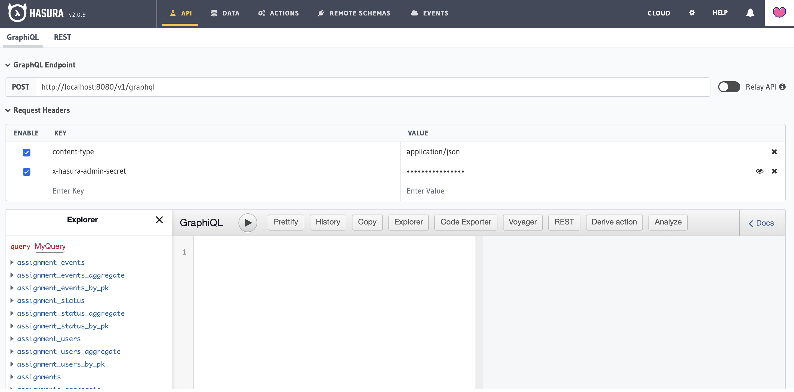

# TestRelay Backend

TestRelay backend service uses [hasura](https://github.com/hasura/graphql-engine) to power a GraphQL API. Event handling
and custom GraphQL resolvers are provided by a GO backend.


## Getting Started

To run the backend service on your local machine run the `docker-compose.yaml` provided in the root directory

```bash
$ docker-compose up -d
```

This will bring up a complete backend stack that you can use to power a local front end.

The hasura console will be available at `localhost:8080/console` and can be logged into using the dev key: **myadminsecretkey**.
Once logged in you should see a screen as below:



From here you'll be able to use the graphql api editor, view and modify database records and check event logs. For more
information check the [hasura docs](https://hasura.io/docs/latest/graphql/core/index.html).

## Development

If you're looking to develop backend functionality use the `docker-compose-devtest.yaml` to develop against. This brings
up a docker stack that is required for the running tests and local interactions.

Running a backend locally requires that you generate some test credentials to 3rd party services. There is an [open ticket](https://github.com/testrelay/testrelay/issues/1#issue-1035924344) 
to improve and document this process. In the meantime, please reach out to us on [slack](https://testrelay.io/slack) for guidance.

For further information on how to development and contributing see the [contributing](../CONTRIBUTING.md) file. 