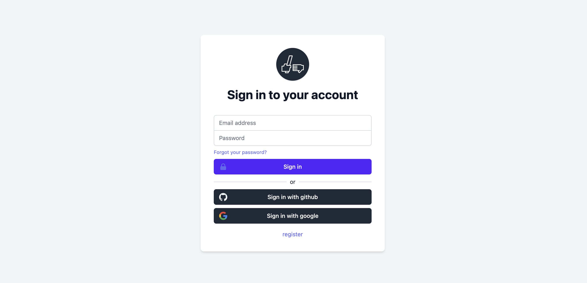

# TestRelay Portal

The React application running both candidate and recruiter versions of the portal.

## Get Started

The portal application renders two different applications based on the subdomain in the host. In order to run portal locally you'll need to
mock these in your `/etc/hosts` file. Add the following lines:

```bash
127.0.0.1        candidates.testrelay.test
127.0.0.1        app.testrelay.test
```

Save & install the project dependencies:

```bash
npm install
```

Then run the app using

```bash
npm start
```

The application runs by on port `4040` so you'll be able to see the different versions of the app by navigating to `app.testrelay.test:4040` and `candidate.testrelay.test:4040` respectively.

If the installation process has worked you should see a login screen similar to this:



## Development 

If you're looking to develop locally you'll need a backend stack up and running. Check out the [backend readme](../backend/README.md) for steps on how get this working. 

Then `mv .env.example .env` add the graphql url to the `.env` in the `REACT_APP_GRAPHQL_URL=` variable. You'll see from the `.env` file there are a number of other dependencies that
you'll have to add there, primarily details to a generated firebase account. At the moment there is an [open ticket](https://github.com/testrelay/testrelay/issues/1#issue-1035924344)
to improve and document the process of provisioning dependencies for local services. In the meantime, please reach out to us on [slack](https://testrelay.io/slack) for guidance.

For further information on how to development and contributing see the [contributing](../CONTRIBUTING.md) file. 

